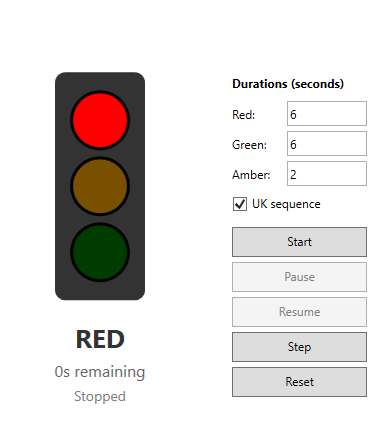

# Traffic Light Simulator - WPF Learning Project

A simple traffic light simulation to help you transition from **console programming** to **WPF (Windows Presentation Foundation)** GUI applications.

Simulates a traffic light using a state machine pattern—a clean way to model systems that move through defined states (Red → Red+Amber → Green → Amber → repeat). You'll learn how WPF apps work (XAML for layout, C# for behaviour), how to handle events like button clicks and timer ticks, and how to keep your logic separate from your UI code. Heavily commented throughout — assumes no prior WPF knowledge needed.



---

## Assumes that you Already Know

This project assumes that you already understand the following from writing console applications and have studied OOP. 

- **Classes and Objects** - creating instances, calling methods
- **Properties** - getters and setters
- **Enums** - named constants like `TrafficLightState.Red`
- **Methods** - writing and calling functions
- **Control flow** - if/else, loops

**Good news:** All of this works exactly the same in WPF! The C# language doesn't change.

---

## What's New in WPF

### 1. XAML = Layout (What the UI Looks Like)

In console apps, you use `Console.WriteLine()` to show output. In WPF, you **create controls** that display things.

**Console:**
```csharp
Console.WriteLine("Hello World");
Console.WriteLine("Press Enter to continue...");
Console.ReadLine();
```

**WPF (XAML):**
```xml
<TextBlock Text="Hello World" />
<TextBlock Text="Press Enter to continue..." />
<Button Content="Continue" />
```

XAML is **declarative** - you describe WHAT you want, not HOW to create it.

### 2. Code-Behind = Behaviour (What Happens)

Each `.xaml` file has a matching `.xaml.cs` file called the "code-behind". This is where you write C# code that runs when things happen.

```
MainWindow.xaml     -> defines the layout (TextBlocks, Buttons, etc.)
MainWindow.xaml.cs  -> handles events (button clicks, timer ticks)
```

### 3. x:Name Connects XAML to C#

In XAML:
```xml
<TextBlock x:Name="StatusText" Text="Waiting..." />
```

In C#:
```csharp
StatusText.Text = "Running!";  // StatusText is now a variable!
```

The `x:Name` attribute creates a field that your code-behind can access.

---

## Understanding Events (New Concept!)

### What is an Event?

In console apps, your code runs top-to-bottom in a predictable order:

```csharp
// Console app - runs line by line
Console.WriteLine("Step 1");
Console.WriteLine("Step 2");
string input = Console.ReadLine();  // Waits here until user types
Console.WriteLine("Step 3");
```

In GUI apps, you don't know WHEN the user will click a button. They might click it immediately, or wait 5 minutes, or never click it at all!

**Events** solve this problem. An event is like a notification system:
- "Hey, the user just clicked this button!"
- "Hey, the timer just ticked!"
- "Hey, the window just loaded!"

### How Events Work (Simple Explanation)

Think of events like a doorbell:

1. **The doorbell exists** (the Button control has a `Click` event)
2. **You decide what to do when it rings** (you write a method to handle it)
3. **You connect your action to the doorbell** (you "subscribe" to the event)
4. **When someone presses it, your action happens** (your method runs)

### Events in XAML (The Easy Way)

In XAML, you connect events like this:

```xml
<Button Content="Click Me" Click="MyButton_Click" />
```

This says: "When this button is clicked, run the method called `MyButton_Click`"

In your code-behind, you write that method:

```csharp
private void MyButton_Click(object sender, RoutedEventArgs e)
{
    // This code runs when the button is clicked!
    StatusText.Text = "You clicked the button!";
}
```

### Events in C# Code (What's Really Happening)

Behind the scenes, the XAML above is doing this:

```csharp
// This happens automatically when the window loads
MyButton.Click += MyButton_Click;
```

The `+=` operator means "subscribe to this event". It's saying:
"When the Click event fires, also run the MyButton_Click method"

You can also unsubscribe with `-=`:
```csharp
MyButton.Click -= MyButton_Click;  // Stop listening to clicks
```

### The Event Handler Method Signature

Event handler methods always look like this:

```csharp
private void SomeName(object sender, SomeEventArgs e)
{
    // Your code here
}
```

- `sender` - the object that triggered the event (e.g., which button was clicked)
- `e` - extra information about the event (e.g., mouse position, key pressed)

For button clicks, you usually ignore both parameters and just do your work.

### Why Two Parameters?

The `sender` parameter is useful when multiple buttons share the same handler:

```csharp
private void AnyButton_Click(object sender, RoutedEventArgs e)
{
    Button clickedButton = (Button)sender;
    StatusText.Text = "You clicked: " + clickedButton.Content;
}
```

---

## Understanding the Timer

### The Problem with Thread.Sleep()

In console apps, you might pause with `Thread.Sleep()`:

```csharp
// Console app - this is fine
while (true)
{
    Console.WriteLine("Tick");
    Thread.Sleep(1000);  // Wait 1 second
}
```

**In WPF, NEVER use Thread.Sleep()!** It freezes the entire window - buttons won't respond, nothing will update. The app appears to crash.

### The Solution: DispatcherTimer

Instead, use `DispatcherTimer`. It fires an event at regular intervals WITHOUT freezing the UI:

```csharp
// Create a timer
DispatcherTimer timer = new DispatcherTimer();

// Set how often it ticks (every 1 second)
timer.Interval = TimeSpan.FromSeconds(1);

// Subscribe to the Tick event (just like button clicks!)
timer.Tick += Timer_Tick;

// Start it running
timer.Start();
```

Then write your event handler:

```csharp
private void Timer_Tick(object sender, EventArgs e)
{
    // This runs every second (or whatever interval you set)
    countdown--;
    CountdownText.Text = countdown + "s remaining";
}
```

### Why DispatcherTimer Works

The DispatcherTimer runs on the "UI thread" - the same thread that handles button clicks and screen updates. This means:

1. It won't freeze the UI
2. It can safely update controls (change text, colours, etc.)
3. Other events (button clicks) can still happen between ticks

---

## The Delegate (Advanced - Optional Reading)

You might wonder: how does C# know which method to call when an event fires?

The answer is **delegates**. A delegate is like a "method reference" - a variable that holds a pointer to a method.

```csharp
// This delegate type can hold any method that takes no parameters and returns void
Action myMethod;

// Store a reference to SayHello
myMethod = SayHello;

// Call it later
myMethod();  // This calls SayHello()

void SayHello()
{
    Console.WriteLine("Hello!");
}
```

Events use delegates internally. When you write:
```csharp
button.Click += MyButton_Click;
```

You're adding `MyButton_Click` to a list of methods that should run when Click fires.

**For this project, you don't need to understand delegates deeply.** Just know that:
- Events let you respond to things happening
- You subscribe with `+=` and a method name
- Your method runs when the event fires

---

## Project Structure

```
TrafficLightWPF/
├── TrafficLightWPF.csproj  <- Project file (build settings)
├── App.xaml                <- Application definition
├── App.xaml.cs             <- Application code (minimal)
├── MainWindow.xaml         <- UI layout (XAML)
├── MainWindow.xaml.cs      <- Event handlers (code-behind)
├── TrafficLightState.cs    <- Enum for states
├── TrafficLightConfig.cs   <- Configuration class
├── TrafficLightController.cs <- State machine logic
└── README.md               <- This file
```

---

## Where Is the State Machine?

**File:** `TrafficLightController.cs`

This class contains ALL the traffic light logic:

- What state we're in (`CurrentState`)
- How many seconds remain (`RemainingSeconds`)
- Whether we're running (`IsRunning`)
- How to transition between states (`GetNextState()`)
- How to handle time passing (`Tick()`)

**Important:** This class has NO WPF code! It doesn't know about buttons, colours, or XAML. It's pure logic that could work in a console app, a web app, or even on a Raspberry Pi.

This is called **Separation of Concerns** - keeping logic separate from presentation.

---

## How Everything Connects

Here's the flow when you click the Start button:

```
1. User clicks [Start] button
        |
        v
2. Button's Click EVENT fires
        |
        v
3. StartButton_Click method runs (your event handler)
        |
        v
4. Method calls _controller.Start(config)
        |
        v
5. Controller updates its internal state
        |
        v
6. Method calls _timer.Start()
        |
        v
7. Timer starts firing Tick EVENTS every 250ms
        |
        v
8. Timer_Tick method runs (another event handler)
        |
        v
9. Method calls _controller.Tick(elapsed, config)
        |
        v
10. Method calls UpdateUI() to refresh the display
```

Every button click and timer tick follows this pattern:
**Event fires -> Handler runs -> Update controller -> Update UI**

---

## How UI Updates Happen

**File:** `MainWindow.xaml.cs` (see `UpdateUI()` method)

```csharp
private void UpdateUI()
{
    // Read state from controller
    TrafficLightState state = _controller.CurrentState;

    // Update lamp colours based on state
    if (TrafficLightController.IsRedOn(state))
    {
        RedLamp.Fill = RedOn;    // Bright red
    }
    else
    {
        RedLamp.Fill = RedOff;   // Dim red
    }

    // Update text displays
    StateText.Text = GetStateDisplayText(state);
    CountdownText.Text = _controller.RemainingSeconds + "s remaining";
}
```

The controller knows WHAT state we're in. The UI code knows HOW to display it.

---

## Running the Project

### In Visual Studio:
1. Open `TrafficLightWPF.sln`
2. Press F5 (or click Start)

### From Command Line:
```bash
cd TrafficLightWPF
dotnet run
```

### Requirements:
- .NET 8 SDK
- Windows (WPF is Windows-only)

---

## Key Files to Study (In Order)

1. **`TrafficLightState.cs`** - Simple enum (familiar!)
2. **`TrafficLightConfig.cs`** - Config class with validation
3. **`TrafficLightController.cs`** - The state machine (no WPF)
4. **`MainWindow.xaml`** - UI layout (read the comments!)
5. **`MainWindow.xaml.cs`** - Event handlers and UI updates

---

## The UK Traffic Light Sequence

**UK sequence** (default):
```
RED -> RED+AMBER -> GREEN -> AMBER -> RED -> ...
```
The RED+AMBER phase warns drivers that green is coming.

**Simple sequence** (uncheck the box):
```
RED -> GREEN -> AMBER -> RED -> ...
```
Common in many other countries.

---

## Common Mistakes to Avoid

### 1. Forgetting InitializeComponent()
```csharp
public MainWindow()
{
    InitializeComponent();  // ALWAYS call this first!
    // Your code after...
}
```

### 2. Using Thread.Sleep()
```csharp
// BAD - freezes the UI!
Thread.Sleep(1000);

// GOOD - use DispatcherTimer instead
```

### 3. Forgetting x:Name
If you can't access a control from code-behind, check it has `x:Name="SomeName"` in the XAML.

### 4. Wrong Event Handler Signature
Event handlers need the right parameters:
```csharp
// CORRECT
private void Button_Click(object sender, RoutedEventArgs e)

// WRONG - won't compile
private void Button_Click()
```

---

## Extension Tasks

Want to extend this project? Here are some ideas:

### Easy
- **Different colours**: Change the ON/OFF colours for the lamps
- **Keyboard shortcuts**: Press 'S' to Start, 'P' to Pause, etc.
- **Sound effects**: Play a beep on state change

### Medium
- **Pedestrian button**: Add a button that requests the light to stop at the next safe point
- **Night mode**: Flashing amber only (common late at night)
- **Event log**: Show state changes in a ListBox at the bottom

### Harder
- **Two traffic lights**: Add a second light for a crossroads
- **Save/load settings**: Remember duration settings between runs
- **Fault mode**: Random chance of entering flashing amber "fault" state

---

## Summary: Console vs WPF

| Aspect | Console App | WPF App |
|--------|-------------|---------|
| Output | `Console.WriteLine()` | Set control properties (`Text`, `Fill`) |
| Input | `Console.ReadLine()` | Events (button clicks, text changes) |
| Timing | `Thread.Sleep()` | `DispatcherTimer` |
| Flow | Top-to-bottom | Event-driven (wait for things to happen) |
| UI Definition | N/A | XAML files |
| UI Updates | N/A | Change control properties in code |

---

## Glossary

| Term | Meaning |
|------|---------|
| **XAML** | eXtensible Application Markup Language - defines UI layout |
| **Code-behind** | The .cs file paired with a .xaml file |
| **Control** | A UI element (Button, TextBox, Ellipse, etc.) |
| **Event** | A notification that something happened (click, tick, etc.) |
| **Event handler** | A method that runs when an event fires |
| **Subscribe** | Connect a handler to an event using `+=` |
| **Delegate** | A type that holds references to methods |
| **DispatcherTimer** | WPF's timer that runs on the UI thread |
| **Brush** | Defines how to paint a surface (colour, gradient, image) |
| **Property** | A setting on a control (Text, Fill, IsEnabled, etc.) |

---

## Need Help?

- Read the comments in each file - they explain everything!
- Check the XAML and code-behind side by side
- Use breakpoints in Visual Studio to step through the code
- Try changing values and see what happens

Good luck with your WPF journey!
